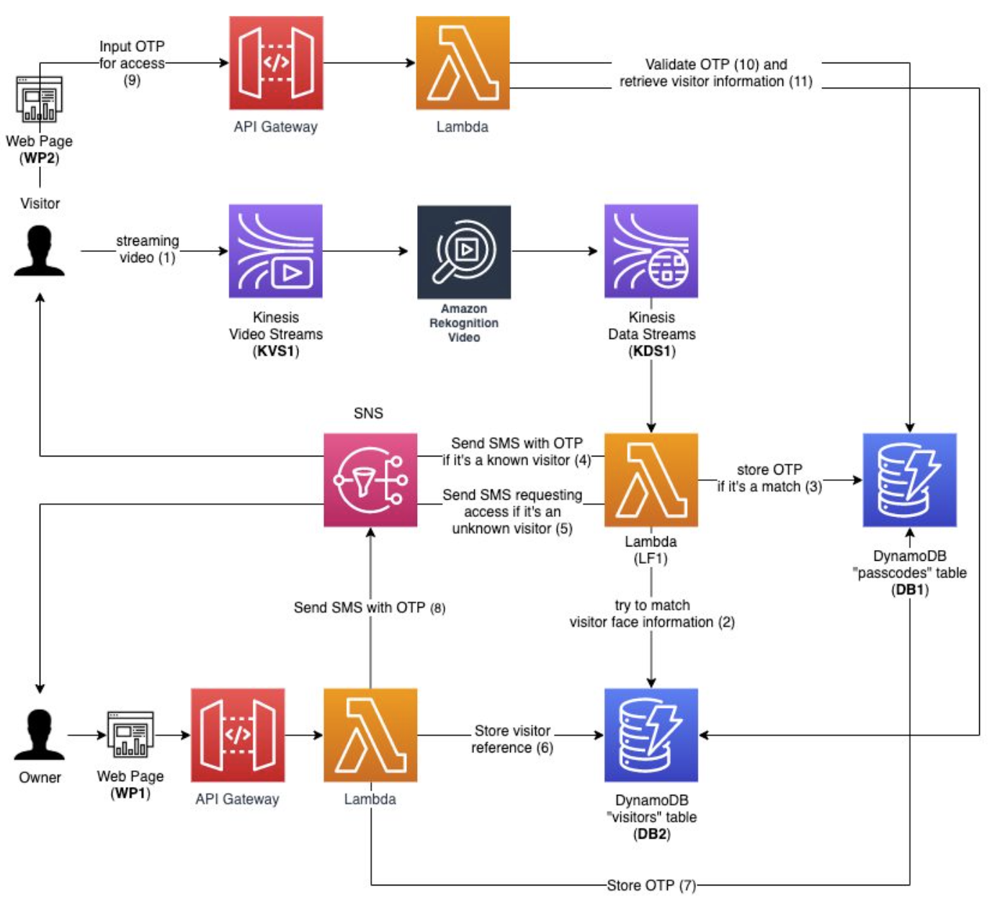

# smart-door-facial-recognition

This application will try to simulate a system that allows a user to be granted access to a location using facial recognition. This applicaiton will be built on AWS. Here is a preliminary baseline architecture. 

#### Notes to deploy lambda function
1. Created S3 bucket to use with cloudformation: smart-door-cloudformation-template
